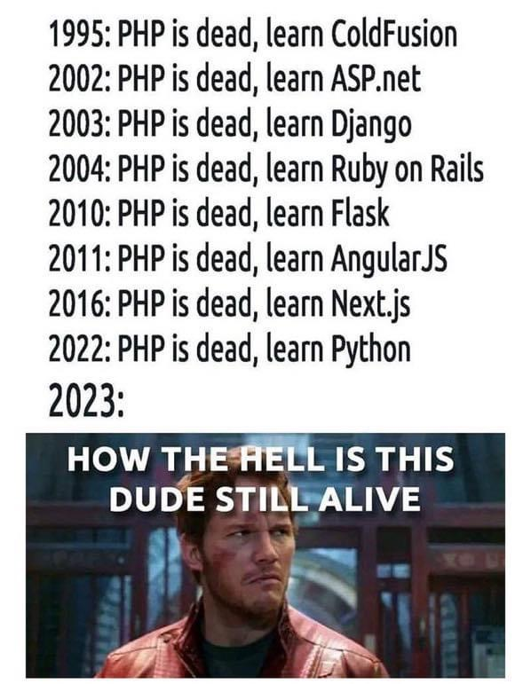

# xxx is dead

## DevOps is dead

- 2022/09/22: [DevOps Is Dead. Embrace Platform Engineering](https://thenewstack.io/devops-is-dead-embrace-platform-engineering/)
- 2022/08/25: [要什么 DevOps，我们开发者根本不想做运维！”](https://www.infoq.cn/article/FfBlx8SYkV9hDBsgolqu)

---
## Other ... [XXX] is dead

- [Kafka is dead, long live Kafka](https://www.warpstream.com/blog/kafka-is-dead-long-live-kafka)
- [API Design Reviews Are Dead. Long Live API Design Reviews!](https://www.infoq.com/articles/api-design-review/)
  - [簡中](https://www.infoq.cn/article/shlKO1bTHS2tCFiFpNe1)
- Microservice is dead
  - 2022/10/07: [microservice 應該是正式死透了。
](https://www.facebook.com/mosky.liu/posts/pfbid02gTxk8jYS1QQXBiTyG7yZHypyWPQhFCzqXRM93YGrkJAHpm445VmMSTcgqpFJx8EUl)
- QA is dead
- [Java is Dead — 5 Misconceptions of developers that still think Java is relevant today!](https://xie.infoq.cn/article/bb16bedb4770c2f4b7ecdd828)
  - [关于 Java 已死，看看国外开发者怎么说的](https://xie.infoq.cn/article/bb16bedb4770c2f4b7ecdd828)
- [Ruby is dead](https://betterprogramming.pub/ruby-is-dead-wait-really-60ca85b8dd06)
- RoR is dead
- [Agile is dead](https://bravegeeks.team/blog/project-management/agile-is-dead-scrum-implementation-survival-guide/)
- TDD is dead
  - 2014/04/23: [TDD is dead. Long live testing.](https://dhh.dk/2014/tdd-is-dead-long-live-testing.html) - DHH
  - [Is TDD Dead?](https://martinfowler.com/articles/is-tdd-dead/) - Martin Fowler
  - [Enterprise Architecture is declared dead](https://www.linkedin.com/pulse/enterprise-architecture-declared-dead-reid-hauke-t%C3%B8nnesen/)
- PHP is dead

